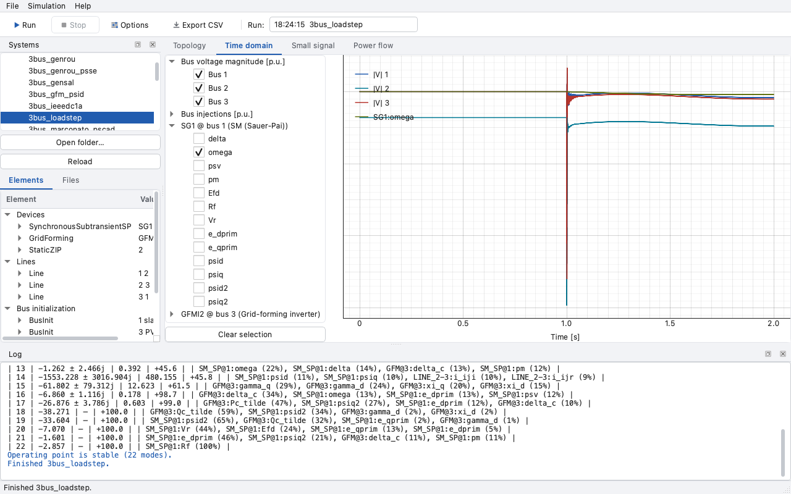
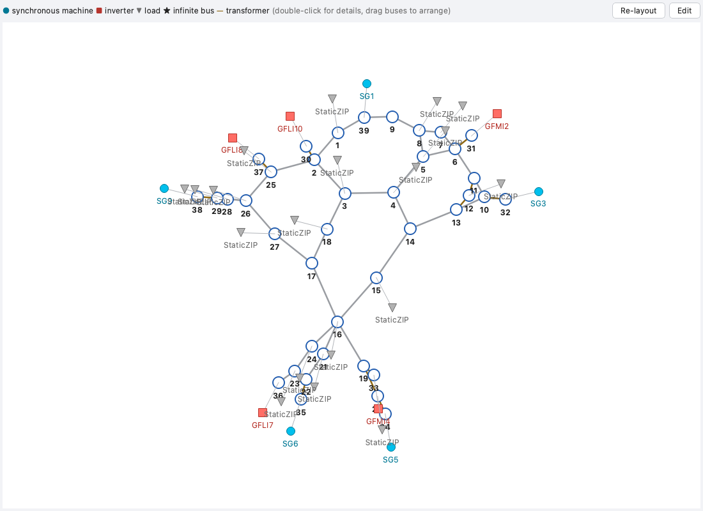
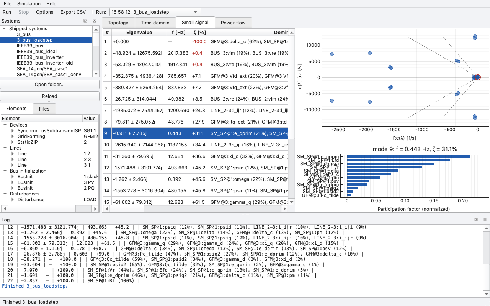

.. _gui:

Graphical interface
===================

HERMESS ships an optional desktop GUI for interactive work: pick a system,
adjust the simulation settings, run, and inspect the trajectories, the
small-signal modes and the initial power flow without writing a script. It is
aimed at exploratory research use and at teaching; batch work and paper
pipelines are better served by the Python API (:ref:`usage`).

Installation and launch
-----------------------

The GUI dependencies (PySide6, pyqtgraph) are an optional extra, so the core
package stays lightweight:

.. code-block:: bash

   pip install -e ".[gui]"     # or:  uv sync --extra gui

Launch it with either of:

.. code-block:: bash

   hermess-gui
   python -m hermess.gui

The window layout, the opened folders, the selected system and the simulation
options persist across sessions.

Layout
------

The window follows the classic desktop tool arrangement. The **Systems** panel
on the left lists the systems shipped with the package and any folders you
open, with an inspector showing the selected system's devices, lines, bus
initialization and disturbances, parsed read-only from its text files, plus
the raw files themselves. The central area holds four viewer tabs, described
below. The **Log** panel at the bottom receives the simulation log, the
initial power flow and the modal report. The toolbar carries Run (``F5``),
Stop, the options dialog, the CSV export and a selector over the finished
runs of the session (the last ten are kept).

Simulations execute in a separate worker process, so the interface stays
responsive during long runs and Stop cancels cleanly. Progress is reported in
the status bar; with disturbances and ``incl_lim`` off, cancellation takes
effect between disturbance intervals.

Running a simulation
--------------------

Select a system and press Run. The settings behind :func:`hermess.simulate`
are edited in the options dialog (Simulation → Options), which exposes the
fields of :class:`~hermess.config.Config`: end time, time step, integration
scheme and its options, reference-frame mode, dynamic or quasi-static lines,
limiters, and the small-signal analysis switch. Only values you change are
carried as overrides; everything else follows the shipped defaults.

To simulate systems of your own, use *Open folder…* and point it either at a
single system folder (containing ``sim_param.txt`` and optionally
``sim_dist.txt``) or at a directory holding several such folders. The GUI
never edits system files: change them in your editor, press *Reload*, and run
again.

Pre-flight checks
^^^^^^^^^^^^^^^^^

Run first validates the system and the options together, so common mistakes
surface as one dialog instead of a failed run. Hard errors block the start: a
network that is not fully connected (with the detached bus groups named), an
ODE-only integration scheme (``cvodes``, ``rk``) applied to a model with
algebraic variables, a ``single`` reference frame pointing at a device that
does not exist in the file, or a time step that is non-positive or larger
than the end time. Questionable but runnable settings, such as a quasi-static
inverter filter on a dynamic network or a very large number of output steps,
are listed as warnings and ask for confirmation.

When the small-signal analysis is enabled, the run additionally pauses at the
initialized operating point if unstable modes are found: a dialog lists them
(eigenvalue, frequency, damping ratio and dominant states) and asks whether
to continue or stop, before any time is spent on an integration that will
likely diverge. Stable operating points are noted in the log and the run
proceeds without interruption.

Viewer tabs
-----------

Topology
^^^^^^^^

A one-line diagram of the selected system, available before any run. Buses
are laid out automatically and can be dragged; devices appear as glyphs
attached to their buses (circle for a synchronous machine, square for an
inverter, triangle for a load), and transformer branches are drawn in bronze.
After a run of the same system, every bus is annotated with its initialized
voltage magnitude and angle.

Double-clicking any component opens a detail pop-up: for a device, a short
model description with the matching control schematics (the same block
diagrams as in :ref:`models`) and the parameters from the system file; for a
bus, its initialization, the connected branches and devices, and the
initialized voltage of the shown run.

Building systems
^^^^^^^^^^^^^^^^

The *Edit* toggle above the diagram turns the topology view into a builder.
A palette provides the tools: *+ Bus* places a bus where you click (the
first one becomes the slack), *+ Line* connects two clicked buses,
*+ Device* offers every available model, shipped or registered through
:func:`hermess.register`, and attaches the chosen one to a clicked bus,
*Delete* removes what you click, and *Disturbances…* edits the event
sequence. Double-clicking an element in edit mode opens its parameter form
instead of the detail pop-up. *File > New system* starts from a blank
canvas; entering edit mode on a selected system edits a copy of it.

The parameter forms are generated from the model classes themselves: every
parameter appears with its default greyed in and its meaning as a tooltip,
and the control strategies (AVR, governor, PSS, shaft; filter, angle,
voltage, inner control, PLL) are chosen from dropdowns that regenerate the
form. Fields left empty use the model defaults and are not written to the
file, so generated files stay as terse as hand-written ones.

While editing, the status line below the canvas shows the live validation of
the pre-flight checks (connectivity, slack bus, solver compatibility, shunt
susceptance under dynamic lines), and every change is undoable. Saving
writes an ordinary system folder (``sim_param.txt`` + ``sim_dist.txt``) to a
location of your choice, never into the installed package; the saved system
appears in the browser and runs, exports and versions like any other.
Re-saving a hand-written system rewrites its files without preserving
comments, so editing an imported system defaults to *Save as*.

No saving is needed while composing. Because a run executes from the files
on disk (the same ones scripts and the CLI use, so every run stays
reproducible), Run asks for a save location the first time; from then on,
running an edited system saves it automatically, and the usual save
shortcut works at any time.

Time domain
^^^^^^^^^^^

The trajectories of the shown run: bus voltage magnitudes, bus injections and
every device's differential states, selected in the tree and overlaid in one
interactive plot (zoom, pan, automatic downsampling for long records).

Small signal
^^^^^^^^^^^^

The modal analysis at the operating point, when ``small_signal_analysis`` is
enabled in the options. The table lists the physical modes (conjugate pairs
collapsed) with frequency and damping ratio, sorted most critical first; the
map shows the eigenvalues with constant-damping guide rays. Selecting a mode,
in the table or by clicking an eigenvalue, highlights it and shows its
normalized participation factors as a bar chart.

Power flow
^^^^^^^^^^

The initial power flow of the shown run as sortable bus and branch tables,
the same data :meth:`~hermess.system.GridSim.power_flow_tables` returns.

Exporting results
-----------------

*File → Export CSV…* writes the signals currently checked in the time-domain
tree as a plot-ready CSV (a ``t`` column plus one named column per signal,
with a header row), together with a ``.provenance.txt`` sidecar recording the
system, the settings, the package version and the date. This is the intended
bridge into a paper's ``data/`` directory. *File → Export figure…* saves the
current tab as a PNG for quick sharing; publication figures should be built
from the exported data instead.
