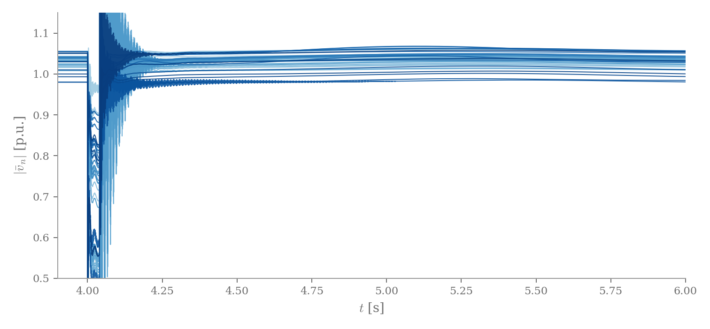

:layout: landing
:description: HERMESS is a hybrid EMT/RMS power system dynamics simulator built on CasADi.

.. rst-class:: front-page

HERMESS
=======

.. rst-class:: front-subtitle

*Hybrid EMT/RMS Modern Electric power System Simulator*

.. rst-class:: front-abstract

HERMESS is a Python simulator for time-domain analysis of electromechanical
and electromagnetic transients in power systems. It formulates the network
and its devices as one nonlinear differential-algebraic system, integrates
it with implicit and explicit schemes built on CasADi, and can keep every
device parameter symbolic, so full trajectories can be differentiated with
respect to them. Its results are benchmarked against ANDES, PSS/E,
PowerSimulationsDynamics.jl and PSCAD.

.. rst-class:: front-links

:doc:`Get started <getting_started/installation>` · `GitHub <https://github.com/maitrayadesai/hermess>`_ · `PyPI <https://pypi.org/project/hermess/>`_ · :ref:`Cite <about>`

.. rst-class:: front-figure

   IEEE 39-bus converter benchmark with dynamic lines: bus voltages through
   a fault and its clearing, electromagnetic transient included.

Quick start
-----------

.. code-block:: bash

   pip install hermess

.. code-block:: python

   import hermess

   hermess.list_systems()                       # the systems that ship with the package
   dae = hermess.simulate("3bus", T_end=5.0)    # run one and get the finished model back

See :ref:`installation` to set up, :ref:`usage` for the everyday entry points
and :ref:`advanced_usage` for the system-file format and the analysis outputs.

Capabilities
------------

.. rst-class:: front-capabilities

:Hybrid EMT/RMS network: Quasi-static or fully dynamic (electromagnetic)
   line models, selected per run, in one DAE formulation; see
   :doc:`network models <models/network>`.
:Differentiable: Parametric sensitivities of full trajectories through
   CasADi, for optimization and learning-based control; see
   :doc:`parametric sensitivities <guide/sensitivities>`.
:Cross-validated: Benchmarked against ANDES, PSS/E,
   PowerSimulationsDynamics.jl and PSCAD; see :doc:`validation`.
:Model library: Machines, AVRs, governors, PSS and shafts, and
   grid-forming, grid-supporting and grid-following converters as pluggable
   strategies; see the :doc:`model library <models/index>`.
:Small-signal analysis: Eigenvalues, participation factors and modal
   reports at the operating point; see :doc:`reading the results <guide/results>`.
:Desktop GUI: Topology, time-domain, small-signal and power-flow views
   with ``hermess-gui``; see the :doc:`graphical interface <gui>`.
:Test systems: IEEE 39-bus with converter variants, Kundur two-area, and
   the 14-generator South East Australian system; see :doc:`systems`.

.. rst-class:: front-cite

If you use HERMESS in academic work, please cite the software release and
the accompanying paper; see :ref:`about` for the references, or the
``CITATION.cff`` in the repository.

.. toctree::
   :maxdepth: 1
   :caption: Getting started
   :hidden:

   getting_started/installation
   getting_started/quickstart
   getting_started/cli

.. toctree::
   :maxdepth: 1
   :caption: User guide
   :hidden:

   guide/simulating
   guide/system_files
   guide/disturbances
   guide/results
   guide/analysis
   guide/sensitivities
   guide/custom_models
   guide/configuration
   gui

.. toctree::
   :maxdepth: 1
   :caption: Model library
   :hidden:

   models/index

.. toctree::
   :maxdepth: 1
   :caption: Examples
   :hidden:

   examples/index

.. toctree::
   :maxdepth: 1
   :caption: Reference
   :hidden:

   systems
   validation

.. toctree::
   :maxdepth: 1
   :caption: API reference
   :hidden:

   api
   autoapi/hermess/index

.. toctree::
   :maxdepth: 1
   :caption: Project
   :hidden:

   about
   dev/contributing
   dev/releasing
   dev/changelog
   license
