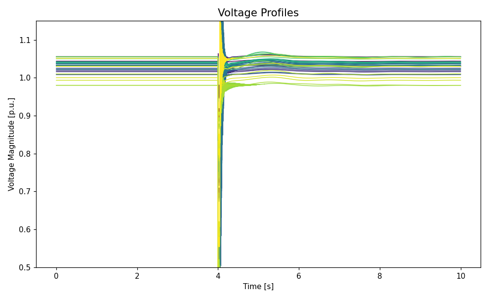
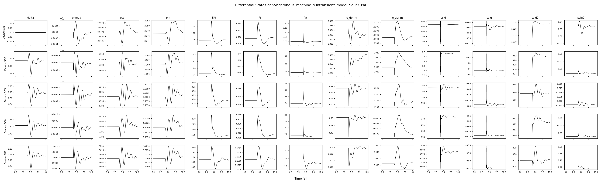

.. _installation:

Installation
============

Prerequisites
-------------

- Python 3.10 or later.
- A C compiler is optional. When ``gcc`` is on the ``PATH`` the CasADi integrator
  is JIT-compiled, which speeds up long runs; without it the simulator falls back
  to the interpreted integrator automatically.

Install from source
-------------------

Clone the repository and install the package in editable mode:

.. code-block:: bash

   git clone https://github.com/maitrayadesai/hermess
   cd hermess
   python -m venv venv
   source venv/bin/activate        # Windows: venv\Scripts\activate
   pip install -e .

The dependencies (CasADi, NumPy, SciPy, pandas, matplotlib, pydantic, tabulate,
tqdm) are declared in ``pyproject.toml`` and are installed with the package.

To also install the optional desktop GUI (PySide6, pyqtgraph; see :ref:`gui`):

.. code-block:: bash

   pip install -e ".[gui]"

With uv
^^^^^^^

If you use `uv <https://docs.astral.sh/uv/>`_, the pinned environment in
``uv.lock`` is reproduced with:

.. code-block:: bash

   uv sync
   uv run python -m hermess

With conda
^^^^^^^^^^

.. code-block:: bash

   conda env create -f environment.yaml
   conda activate hermess

A ``requirements.txt`` with fully pinned versions is also provided, exported from
``uv.lock``, for environments that need an exact reproduction of the tested
dependency set.

Verifying the installation
--------------------------

Run the shipped configuration:

.. code-block:: bash

   python -m hermess

This simulates the system selected in ``hermess/config.py`` -- as shipped, ten
seconds of the IEEE 39-bus converter system (:ref:`ieee39_conv`) with
dynamic line models and a small-signal analysis at the operating point, so
expect a runtime of a few minutes -- and plots the bus voltages and the
internal states. If the two figures below appear, the installation works.

Alternatively, from Python:

.. code-block:: python

   import hermess

   hermess.list_systems()                       # the systems that ship with the package
   dae = hermess.simulate("3bus", T_end=5.0)   # run one and get the finished model back
   print(dae.x_full.shape)

The test suite is another check, and needs ``pytest``:

.. code-block:: bash

   pip install pytest
   pytest -q

   Figure 1: Simulated bus voltage magnitudes of the shipped IEEE 39-bus
   converter scenario.

   Figure 2: Simulated differential states of the synchronous machines in the
   same run (one row per machine, one column per state).

Troubleshooting
---------------

- **The plots do not appear.** The interactive backend is only selected when a
  run asks for figures. In a headless environment (a server, CI) set
  ``MPLBACKEND=Agg`` and use ``plot=False``, then plot from the returned object.
- **A run fails during initialization.** The power flow has to converge before
  the time-domain simulation starts. Check the ``BusInit`` entries of the system
  file, in particular that exactly one bus is declared ``slack``.
- **Dependency conflicts.** Install into a clean virtual environment rather than
  the system Python.
