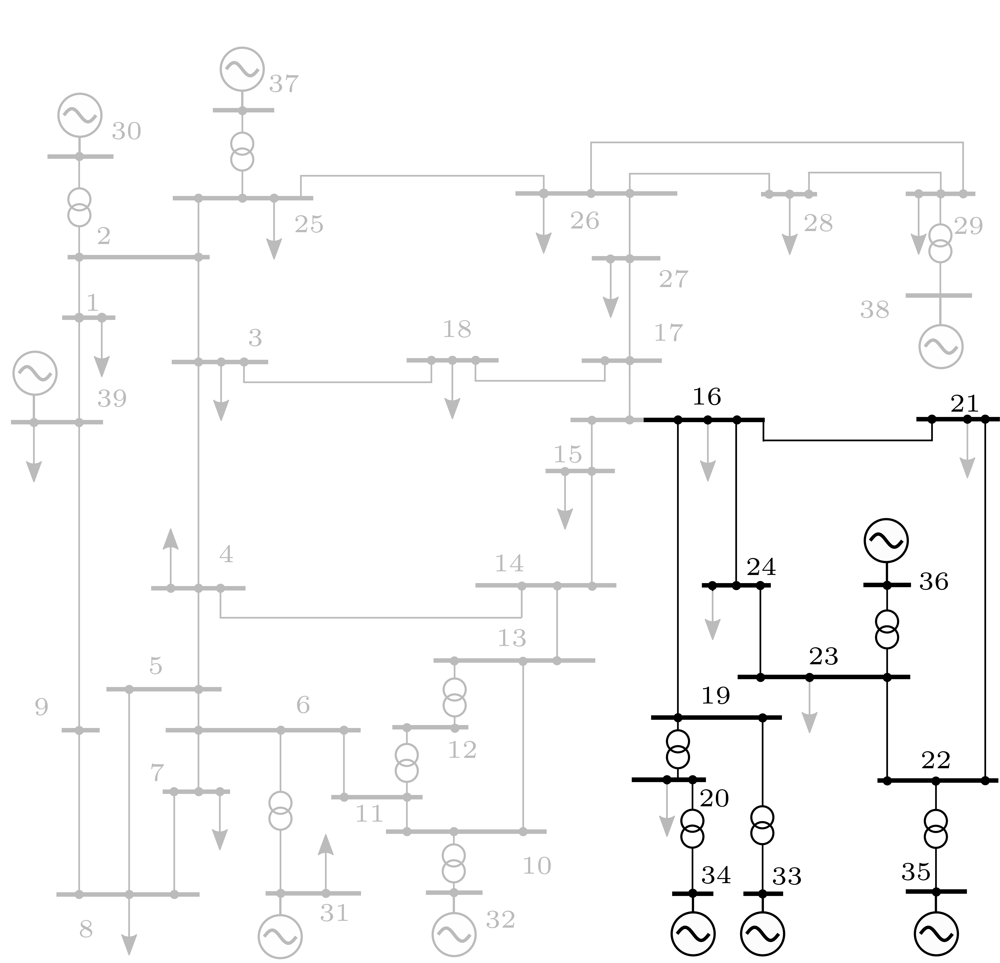

.. _test_cases:

Test Cases
==========

The systems that ship with the package live in
`hermess/systems <https://github.com/maitrayadesai/hermess/tree/main/hermess/systems>`_.
Each one is a folder holding a ``sim_param.txt`` (network, devices, initialization)
and a ``sim_dist.txt`` (disturbances), described in :ref:`advanced_usage`.

The list is available at runtime, so it never goes out of date:

.. code-block:: python

   import hermess

   hermess.list_systems()
   dae = hermess.simulate("ieee39", T_end=10.0)

Small systems
-------------

.. _3bus:

``3bus``
^^^^^^^^^

Three buses and three lines: a Sauer-Pai synchronous machine at bus 1, a
grid-forming converter at bus 3 and a ZIP load at bus 2. The smallest system that
still contains both a machine and a converter, which makes it the usual starting
point and the one used by most of the test suite. Disturbance: a line opening.

.. _3bus_loadstep:

``3bus_loadstep``
^^^^^^^^^^^^^^^^^^

The same three-bus network with a single small load step instead of the line
opening: a minimal setpoint-style event that stays in the linear regime while
still exciting the grid-forming converter's power and frequency response.

.. _3bus_genrou:

``3bus_genrou``
^^^^^^^^^^^^^^^

A three-bus triangle with two round-rotor GENROU machines (buses 1 and 3) and
a constant-impedance load (bus 2), with excitation and turbine dynamics
deliberately excluded (``AVRCONST`` / ``GOVCONST``). This is the cross-tool
validation case for the GENROU machine model, compared against ANDES in CI;
see :ref:`validation`. Disturbance: a line opening.

.. _3bus_gensal:

``3bus_gensal``
^^^^^^^^^^^^^^^

The same network with two salient-pole GENSAL machines: the cross-tool
validation case for GENSAL (see :ref:`validation`). Disturbance: a line
opening.

.. _3bus_tgov1:

``3bus_tgov1``
^^^^^^^^^^^^^^

The GENROU pair with a TGOV1 turbine governor closed around each machine and
no other speed feedback (D = 0): the cross-tool validation case for TGOV1
(see :ref:`validation`). Disturbance: a line opening, which leaves a power
imbalance for the governors to pick up.

.. _3bus_sexst:

``3bus_sexst``
^^^^^^^^^^^^^^

The GENROU pair with the simplified static exciter SEXST closed around each
machine: the cross-tool validation case for SEXST (see :ref:`validation`).
Disturbance: a line opening, whose voltage step exercises the exciters.

.. _3bus_avrst1a:

``3bus_avrst1a``
^^^^^^^^^^^^^^^^

The GENROU pair with the ST1A static exciter (transducer,
transient-gain-reduction lead-lag, regulator lag): the cross-tool validation
case for AVRST1A (see :ref:`validation`). Disturbance: a line opening.

.. _3bus_ieeedc1a:

``3bus_ieeedc1a``
^^^^^^^^^^^^^^^^^

The GENROU pair with the IEEE DC1A rotating exciter (Sauer-Pai parameter
set): the cross-tool validation case for IEEEDC1A (see :ref:`validation`).
Disturbance: a line opening.

.. _3bus_avrac1a:

``3bus_avrac1a``
^^^^^^^^^^^^^^^^

The GENROU pair with the AC1A exciter in its small-signal form, at a
high-gain fast-regulator parameter set: the cross-tool validation case for
AVRAC1A (see :ref:`validation`). Disturbance: a line opening.

.. _3bus_psskundur:

``3bus_psskundur``
^^^^^^^^^^^^^^^^^^

The GENROU pair with the SEXST exciter and the Kundur speed-input stabilizer:
the cross-tool validation case for PSSKundur (see :ref:`validation`).
Disturbance: a line opening, whose rotor swings exercise the stabilizer path.

.. _3bus_genrou_psse:

``3bus_genrou_psse``
^^^^^^^^^^^^^^^^^^^^

The three-bus PSS/E benchmark system (60 Hz): an infinite bus, one
saturation-free GENROU, and a constant-impedance load, transcribed from the
``ThreeBusMulti`` case of the PowerSimulationsDynamics.jl benchmark set. The
cross-tool validation case against a PSS/E-produced trajectory (see
:ref:`validation`); run it with ``fn=60`` and ``T_end=20``. Disturbance: a
line opening.

.. _3bus_gfm_psid:

``3bus_gfm_psid``
^^^^^^^^^^^^^^^^^

Ideal source, droop grid-forming converter (D'Arco parameter set) and
constant-impedance load: the cross-tool validation case for GridForming
against PowerSimulationsDynamics.jl (see :ref:`validation`). Disturbance: a
load step.

.. _3bus_sauerpai_psid:

``3bus_sauerpai_psid``
^^^^^^^^^^^^^^^^^^^^^^

Ideal source, the six-state Sauer-Pai machine with constant excitation and
mechanical power, and a constant-impedance load: the cross-tool validation
case for SynchronousSubtransientSP against PSID (see :ref:`validation`).
Disturbance: a load step.

.. _3bus_shaft5mass_psid:

``3bus_shaft5mass_psid``
^^^^^^^^^^^^^^^^^^^^^^^^

The Sauer-Pai machine on the five-mass torsional shaft HP-IP-LP-GEN-EXC
(Sauer-Pai torsional data): the cross-tool validation case for Shaft5Mass
against PSID (see :ref:`validation`). Disturbance: a load step, whose
electrical-torque step rings the torsional modes.

.. _3bus_dynlines_psid:

``3bus_dynlines_psid``
^^^^^^^^^^^^^^^^^^^^^^

The Sauer-Pai system with the network itself dynamic (run it with
``line_dyn=True``): every line current and bus voltage is a differential
state. The cross-tool validation case for the dynamic network against PSID
(see :ref:`validation`). Disturbance: a load step.

.. _omib_gfm_pscad:

``omib_gfm_pscad``
^^^^^^^^^^^^^^^^^^

The one-machine-infinite-bus system of the PSCAD Test23 benchmark: the full
D'Arco droop grid-forming converter (active damping, split power-filter
corners) against an ideal source. Validated against both PSID and the PSCAD
electromagnetic trajectory (see :ref:`validation`). Disturbance: a
reference-power step (the ``SETPOINT`` event).

.. _omib_vsm_pscad:

``omib_vsm_pscad``
^^^^^^^^^^^^^^^^^^

The OMIB of the PSCAD Test08 benchmark: the virtual-synchronous-machine
converter (``angle = "VSM"`` with the Kaura PLL and damped inner control).
Validated against both PSID and PSCAD (see :ref:`validation`). Disturbance:
a reference-power step.

.. _omib_gfl_pscad:

``omib_gfl_pscad``
^^^^^^^^^^^^^^^^^^

The OMIB of the PSCAD Test24 benchmark: the current-injecting GridFollowing
converter (PI power outers, current-mode inner, reduced-order PLL).
Validated against PSID exactly and compared against the PSCAD trace (see
:ref:`validation`). Disturbance: a reference-power step.

.. _3bus_marconato_pscad:

``3bus_marconato_pscad``
^^^^^^^^^^^^^^^^^^^^^^^^

The three-bus system of the PSCAD Test25 benchmark (60 Hz): two Marconato
machines (Type II governor and fixed torque, AVRSimple exciters) with every
line dynamic (run it with ``line_dyn=True`` and ``fn=60``). Validated
against PSID and the PSCAD voltage trajectory (see :ref:`validation`).
Disturbance: a reference-power step.

.. _kundur:

``kundur``
^^^^^^^^^^^^^^^^^^^^^^

The Kundur two-area system, twelve buses with four subtransient machines and
three ZIP loads, exercising the automatic voltage regulators. Disturbance: a load
step. The classic system for inter-area oscillation studies.

.. _kundur_conv:

``kundur_conv``
^^^^^^^^^^^^^^^^^^^^

The two-area system with two of the four machines replaced by grid-forming
converters, for comparing converter-dominated against machine-dominated dynamics
on an otherwise identical network. Disturbance: a load step.

IEEE 39-bus systems
-------------------

.. _ieee39:

``ieee39``
^^^^^^^^^^^^^^

The standard IEEE 39-bus (New England) benchmark: 39 buses, 46 branches, ten
subtransient synchronous machines and nineteen ZIP loads. It is simulated in the
time domain to study the electromechanical response to a sequence of
disturbances:

- short circuit on branch 5-8 (t = 7.00 s),
- fault cleared by opening the branch at both ends (t = 7.04 s),
- load change at bus 5 (t = 9.00 s).

   Figure 1: The IEEE 39-bus network.

.. _ieee39_conv:

``ieee39_conv``
^^^^^^^^^^^^^^^^^^^^^^^

A converter-penetrated variant of the same network: five Sauer-Pai synchronous
machines, two grid-forming and three grid-following converters, nineteen ZIP
loads. Disturbance: a bus fault and its clearing.

.. figure:: _static/39network_inv.jpg
   :alt: IEEE 39-bus network with converters
   :width: 600px

   Figure 2: The IEEE 39-bus network with grid-forming and grid-following converters.

.. _ieee39_ideal:

``ieee39_ideal``
^^^^^^^^^^^^^^^^^^^^

The 39-bus network with constant-power loads instead of ZIP loads and a longer
disturbance sequence: a line fault followed by the line opening, a bus fault and
its clearing, and a load step. Inherited from the parent project, where
it served as the idealized-measurement scenario, and kept as a functional test
that the simulator reproduces the expected response.

.. _ieee39_conv_old:

``ieee39_conv_old``
^^^^^^^^^^^^^^^^^^^^^^^^^^^

An earlier converter-penetrated variant, kept for comparison with results
produced before the converter models were reworked. Prefer
:ref:`ieee39_conv` for new work.

.. _sea14gen:

The 14-generator South East Australian system
---------------------------------------------

A 59-bus, 76-branch, five-area, 50 Hz benchmark with fourteen aggregated power
stations and five static var compensators, from M. Gibbard and D. Vowles,
*Simplified 14-Generator Model of the South East Australian Power System*,
University of Adelaide, revision 4, 2014. The parameter tables are transcribed
into ``sea_data.py`` and ``sea_dynamics.py``; the report itself is not
redistributed.

The case folders are generated by ``build_sea_system.py`` and can be validated
against the published load flow and rotor modes with ``validate_sea.py``. Both
are repo-only developer tools (run from a source checkout, not shipped in the
wheel), because they write the case folders next to themselves:

.. code-block:: bash

   python hermess/systems/sea14gen/build_sea_system.py 1
   python hermess/systems/sea14gen/validate_sea.py 1
   python hermess/systems/sea14gen/build_sea_system.py 1 --no-pss

``sea14gen/case1``
^^^^^^^^^^^^^^^^^^^^

Operating case 1 of the benchmark: twelve round-rotor (``GENROU``) and two
salient-pole (``GENSAL``) machines with ST1A and AC1A exciters and speed
stabilizers, five SVCs and thirty-two ZIP loads. Disturbance: a bus fault and its
clearing.

``sea14gen/case1_nopss``
^^^^^^^^^^^^^^^^^^^^^^^^^^

Operating case 1 with the power system stabilizers removed, which is how the
benchmark exposes its poorly damped inter-area modes.

``sea14gen/case1_conv``
^^^^^^^^^^^^^^^^^^^^^^^^^

Operating case 1 with three of the stations replaced by converters, two
grid-forming and one grid-following, keeping the SVCs and the load pattern.

``sea14gen/case2`` ... ``sea14gen/case6``
^^^^^^^^^^^^^^^^^^^^^^^^^^^^^^^^^^^^^^^^^^

The remaining five published operating conditions of the benchmark, spanning
heavy to light system loading, each with the exciter and stabilizer settings of
the report and a ``_nopss`` variant with the stabilizers removed. All folders
are generated by the current ``build_sea_system.py`` and validated against the
published load flow and rotor modes with ``validate_sea.py``. Disturbance in
every case: a 100 ms bus fault and its clearing.

===== ==================== =============
Case  Total generation      Total load
===== ==================== =============
1     23030 MW             22300 MW
2     21590 MW             21000 MW
3     25430 MW             24800 MW
4     15050 MW             14810 MW
5     19060 MW             18600 MW
6     14840 MW             14630 MW
===== ==================== =============

``sea14gen/smib``
^^^^^^^^^^^^^^^^^

A single ``GENROU`` machine against an infinite bus, used to cross-check the
machine implementation against the benchmark equations in isolation. No
disturbance.
