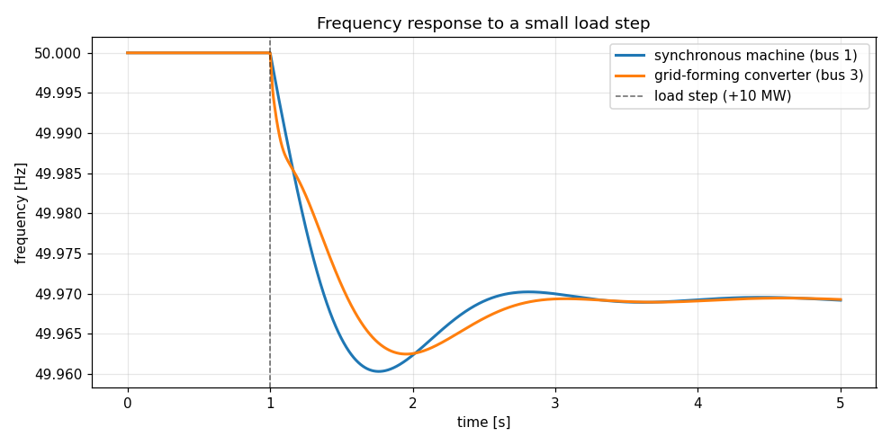
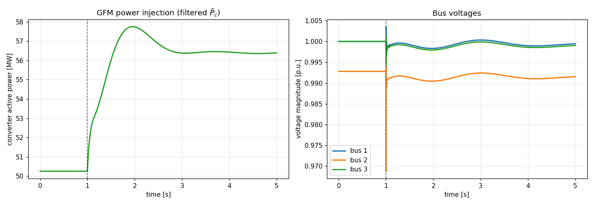

# Grid-forming converter frequency control → PyTorch

A self-contained tutorial notebook that walks through using this repo and bridges
the simulator to PyTorch, aimed at building a **neural-network controller for a
grid-forming converter (GFM)** to improve frequency response.

## Notebook

**[`3bus_gfm_nn_control.ipynb`](./3bus_gfm_nn_control.ipynb)** — runs top to bottom:

1. How a system is described (`sim_param.txt` / `sim_dist.txt`) and simulated.
2. A 3-bus example — synchronous machine + droop grid-forming converter + a small
   **+10 MW load step**, with **dynamic line models** (`line_dyn=True`) and **no
   state limiters** (`incl_lim=False`).
3. The converter's **frequency response** to the load step (figures below).
4. The underlying DAE and its **CasADi symbolic objects**.
5. A differentiable plant `F(z) → ż` with **exact Jacobians** (CasADi autodiff).
6. Adding the network's **residual power-setpoint signal Δp_c\*** *on top of* the
   droop — `ω_c = ω_c* + R_c^p (p_c* + Δp_c* − p̃_c)` — so Δp_c\* = 0 recovers the
   original plant exactly.
7. A **CasADi → PyTorch** bridge: the stiff-safe, differentiable plant wrapped as a
   `torch.autograd.Function`, plus a tiny differentiable-simulation training loop.

## Expected output

| Frequency response | Power & voltages |
|---|---|
|  |  |

After the load step, both the machine and the converter dip ~0.04 Hz and recover;
the converter ramps its injection from ~50 to ~57 MW to supply the extra load. The
brief voltage transient at the load bus is the fast electromagnetic line dynamics
that `line_dyn=True` retains.

## Requirements

- The repo installed: `pip install -e .` from the repo root.
- `numpy`, `casadi`, `matplotlib` (already dependencies).
- For the final PyTorch section only: `pip install torch`. Every other cell runs
  without it.

## The system

Defined in [`hermess/systems/3bus_loadstep/`](../../hermess/systems/3bus_loadstep).
Edit `sim_param.txt` (e.g. the droop gain `Kp`) or `sim_dist.txt` (the load step) to
change the experiment.
